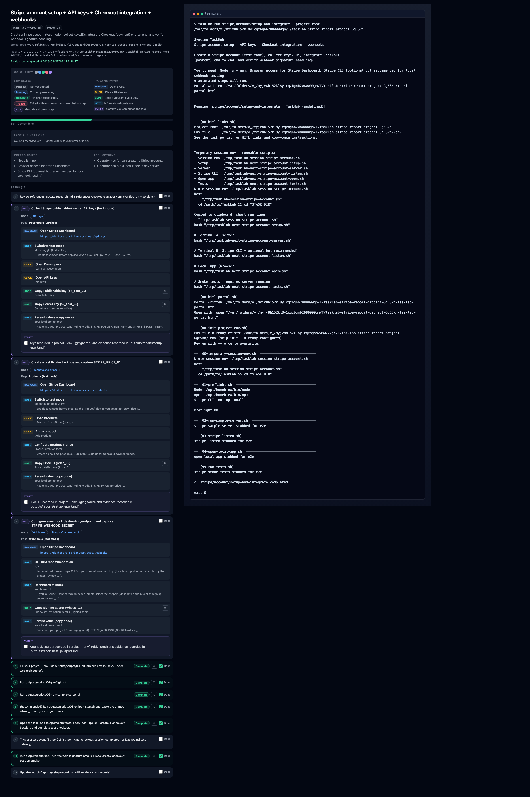
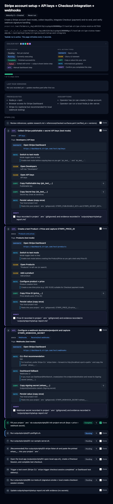

# TaskLab

 

> [!WARNING]
> **Pre-alpha — not ready for use.** The CLI and task runner are under active development. Watch or star to follow progress.

---

Integrating a third-party service is never just one step. It's a dozen browser tabs, a handful of CLI commands, three copy-pastes from dashboards you can never find again, and a webhook secret you typed wrong the first time.

TaskLab turns that into a single command.

```bash
tasklab run stripe/account/setup-and-integrate
```

Each task is a playbook that knows what can be automated and what can't. Before presenting a manual step, TaskLab checks whether an API, CLI, or MCP can do it instead — reducing human-in-the-loop (HITL) steps to the absolute minimum. When a dashboard click genuinely can't be avoided, TaskLab guides you through it precisely: exact menu path, what to copy, where it goes, and a confirmation check.

The result: service integrations that take minutes instead of hours, work the same way every time, and leave no secrets in your repo.

---

## User journey

### 1. First run — use a community task

Install and run a task from [TaskHub](https://github.com/timermachine/taskhub), the community library:

```bash
npm install -g tasklab

cd my-project
tasklab run stripe/account/setup-and-integrate
```

TaskLab syncs the latest tasks from TaskHub, runs preflight checks, executes setup scripts, and pauses when it needs you — guiding you through any required dashboard steps. Credentials and generated code land in your project directory. The task folder stays clean.



The portal (a local HTML file) opens automatically and shows live run state: which steps completed, which failed, and the output from each.



Or use the interactive picker to browse available tasks:

```bash
tasklab          # syncs TaskHub, shows picker
tasklab list     # print all tasks
```

---

### 2. Wire it to your AI agent

Run `tasklab init` once in any project:

```bash
tasklab init
```

This writes `AGENTS.md` — instructions that teach Claude, Gemini, Copilot, or any other agent how to discover and run tasks, respect HITL steps, and handle secrets correctly. Agents call `tasklab run`; they never invoke scripts directly.

---

### 3. Customise — create your own task

When no community task fits, scaffold one locally:

```bash
tasklab init stripe/my-custom-flow
# → creates ~/.tasklab/tasks/stripe/my-custom-flow/
```

Tasks live in `~/.tasklab/tasks/` — shared across all your projects on this machine, not inside any single project directory. A local task of the same name overrides the TaskHub version.

```
~/.tasklab/tasks/
└── stripe/
    └── my-custom-flow/
        ├── task.yaml          ← goal, scope, inputs, outputs
        ├── plan.yaml          ← ordered steps
        └── outputs/scripts/   ← your setup scripts
```

Edit the scaffolded files, then run it like any other task:

```bash
tasklab run stripe/my-custom-flow
tasklab test stripe/my-custom-flow   # run only the smoke tests
```

To scaffold with an AI agent authoring the task for you:

```bash
tasklab init stripe/my-custom-flow claude
tasklab init stripe/my-custom-flow codex
```

The agent fills in `task.yaml`, `plan.yaml`, and the scripts based on your project context, pausing for your input at HITL steps.

---

### 4. Improve a task from TaskHub

After running a community task you may spot issues — a broken dashboard URL, a missing preflight check, a HITL step that could be automated. Override and fix it locally:

```bash
tasklab init stripe/account/setup-and-integrate   # copies task to ~/.tasklab/tasks/
# edit the files
tasklab run stripe/account/setup-and-integrate    # runs your version
```

---

### 5. Contribute back to TaskHub

Once your task or improvement is working:

```bash
tasklab export stripe/my-custom-flow
```

`tasklab export`:
- scans for secrets (blocks export if any are found)
- diffs your version against TaskHub
- stages clean files to `~/.tasklab/export/`
- opens a pull request on [TaskHub](https://github.com/timermachine/taskhub) via `gh`

Agent notes from your run — hurdles you hit, suggestions for improvement — are included in the PR body automatically from `capture.json`.

Merge standards are in TaskHub's [CONTRIBUTING.md](https://github.com/timermachine/taskhub/blob/main/CONTRIBUTING.md).

---

## TaskHub

[TaskHub](https://github.com/timermachine/taskhub) is the curated community library. TaskLab syncs from it automatically before every run.

Current integrations:

| Service | Task |
|---------|------|
| Stripe | Account setup + local integration |
| Stripe | Webhook setup + verify |
| Supabase | Project setup (Auth, Edge Functions, types) |
| Google Wallet | Generic pass setup |
| Apple Wallet | iOS .pkpass setup |
| Spotify | OAuth setup + integration |
| Shelly | Android app setup + build |
| PayPal | Sandbox setup + Node.js Orders API |

---

## Install

```bash
npm install -g tasklab
```

Requires Node.js 18+.

---

## How tasks are structured

```
~/.tasklab/tasks/<service>/<task-name>/
  task.yaml               Goal, scope, inputs, outputs, completion criteria
  plan.yaml               Ordered steps (human-readable)
  manifest.yaml           Maturity level + run history
  inputs.example.yaml     Template for your .env values (no secrets)
  research.md             Surface decisions, docs verified on date
  hitl/*.step.yaml        Guided manual steps (dashboard/web UI)
  outputs/scripts/
    00-hitl-links.sh      Deep links + copy-once guidance
    01-preflight.sh       Env validation (fail-closed)
    02-*.sh … 09-*.sh     Main setup steps
    99-run-tests.sh       Smoke tests
  references/             Docs links, checked-surfaces.yaml
```

Runtime artifacts (credentials, generated code, run state) always go to your project directory — never into the task folder.

---

## Design principles

- **Execution surface priority**: API → CLI → MCP → HITL web — automation is always preferred
- **Fail-closed**: scripts validate env vars before running; any error stops the run
- **Copy once**: any value you need to paste is captured to a file immediately
- **Two-directory model**: task folder = scripts and templates; project folder = all runtime artifacts
- **No stale tasks**: always pulls fresh from TaskHub before running

---

## License

MIT
