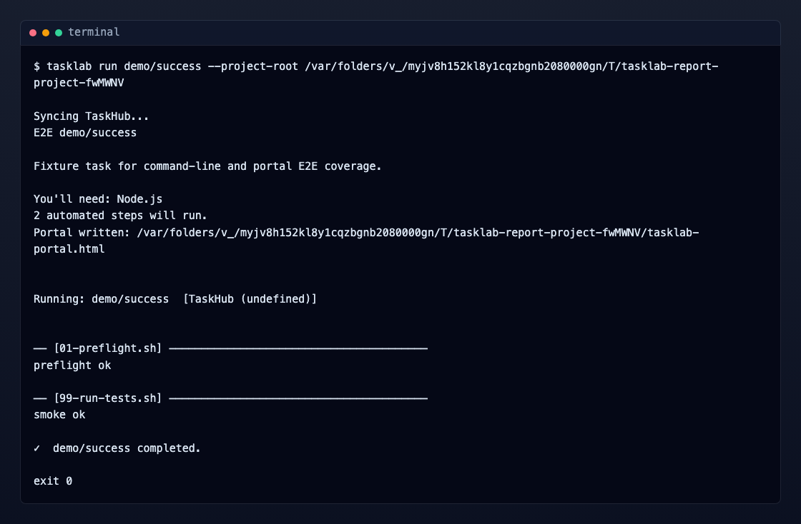
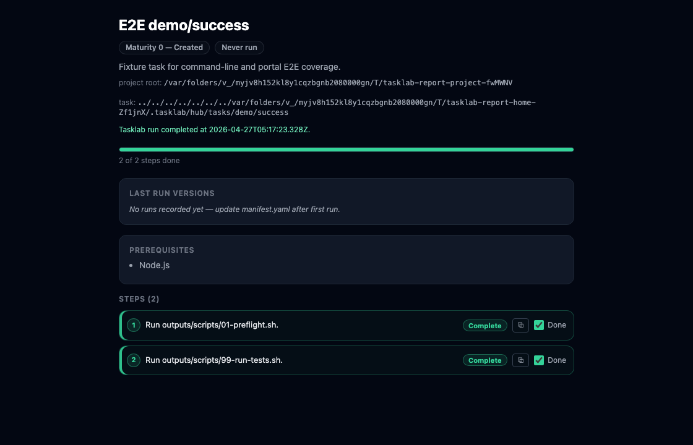

# Interaction Report: Run A TaskHub Task

This report describes the user interaction for running a TaskHub task through TaskLab. It focuses on what the user types, where they type it, and what they see across npm, the command line, an AI agent, and the task portal.

Screenshots were generated from the current E2E fixture with:

```bash
npm run docs:run-report-assets
```

## Summary

Primary journey:

1. User installs TaskLab from npm.
2. User runs a TaskHub task from the command line.
3. TaskLab syncs TaskHub, prints a preamble, creates run-state, and opens or writes the task portal.
4. The task portal shows task progress and HITL guidance.
5. TaskLab runs scripts and updates portal status.
6. User sees completion or failure in both CLI and portal.

The CLI is the execution harness. The task portal is the preferred operator surface. The AI agent is optional during this journey: it can suggest a task, explain failures, or help improve a local override, but it does not need to be in the critical path for a normal TaskHub run.

## Screenshot: Command Line



## Screenshot: Task Portal



## Interaction Timeline

| Step | Surface | What The User Types Or Does | What TaskLab Does | What The User Sees |
| --- | --- | --- | --- | --- |
| 1 | npm / shell | `npm install -g tasklab` or project-local install command | Installs the `tasklab` bin | npm install output; then `tasklab` is available on PATH |
| 2 | command line | `tasklab run stripe/account/setup-and-integrate` | Starts the run flow | `Syncing TaskHub...` |
| 3 | command line | No input, unless running interactively and confirmation is enabled | Syncs or uses cached TaskHub, resolves task slug, checks DSL compatibility | Task title, summary, prerequisites, and automated step count |
| 4 | command line | In a TTY: answers `y` to `Ready to start? [y/N]:` | Creates `.tasklab-runs/current.json` with pending script statuses | Confirmation that the portal opened, or `Portal written: <path>` when browser opening is disabled |
| 5 | task portal | Opens automatically, or user opens `tasklab-portal.html` | Renders `task.yaml`, `plan.yaml`, HITL files, manifest data, and run-state | Task title, maturity, last run status, prerequisites, progress bar, and step cards |
| 6 | task portal | Clicks dashboard/doc links, copies values, checks manual verification boxes | Browser stores local visited/check state; manual verify boxes can show partial completion | Visited links turn green; HITL verification can move from pending to partial to done |
| 7 | command line | No input for automated scripts | Runs each `outputs/scripts/*.sh` in order with `--project-root` and optional `--env-file` | Script banners and script output such as preflight and smoke-test results |
| 8 | task portal | Watches progress or refreshes page | TaskLab updates `.tasklab-runs/current.json` and regenerates portal after each script state change | Pending is gray, running is blue, complete is green, failed is red |
| 9 | command line | If a script fails, follows the printed direct command or asks an AI agent for help | Exits non-zero and keeps failed state in run-state | Failed script name, exit code, suggested direct rerun command |
| 10 | command line / portal | On success, no further input | Writes provenance under `.tasklab-runs/` | CLI prints `<slug> completed`; portal shows completed status and a full green progress bar |

## What The User Types

Install:

```bash
npm install -g tasklab
```

Run by slug:

```bash
tasklab run stripe/account/setup-and-integrate
```

Run with explicit project root:

```bash
tasklab run stripe/account/setup-and-integrate --project-root ~/my-app
```

Run with explicit env file:

```bash
tasklab run stripe/account/setup-and-integrate --project-root ~/my-app --env-file ~/my-app/.env.local
```

If an AI agent is involved, the user types into the agent chat rather than into TaskLab:

```text
Run the Stripe setup task with TaskLab, watch the task portal, and help me fix any failed step.
```

The agent should then use TaskLab’s command-line surface:

```bash
tasklab run stripe/account/setup-and-integrate --project-root <project-dir>
```

## What The User Sees By Surface

### npm

The npm surface is only the install/update surface. The user sees package installation output and any dependency warnings. TaskLab should not require npm again during a normal task run unless a task script transparently installs task-local dependencies.

### Command Line

The command line shows:

- TaskHub sync state
- Task preamble
- prerequisites
- automated step count
- portal path/opening message
- per-script banners
- script stdout/stderr
- completion or failure

The CLI also captures the execution result for tests: stdout, stderr, and process exit code.

### Task Portal

The task portal shows:

- task title and summary
- maturity and last-run metadata
- project root and task path
- run-state message
- progress bar
- prerequisites and assumptions
- step cards
- copy buttons
- HITL links and verification checks
- color-coded status

Status colors:

- gray: pending
- blue: running
- amber: partially complete manual/HITL checks
- green: complete
- red: failed

### AI Agent

The AI agent is not required to run a known TaskHub task. Its best role is assistive:

- recommend which task to run
- explain preamble or portal state
- watch a failed command transcript
- suggest a fix
- help create a local override
- help export an improvement back to TaskHub

The agent should not bypass TaskLab by running task scripts directly. It should use `tasklab run <slug>` so the CLI, portal, run-state, provenance, and contribution prompts stay coherent.

## Capture Strategy

Current E2E capture:

- CLI is captured by spawning `node bin/tasklab.js ...`
- stdout, stderr, and exit code are asserted
- TaskHub is faked with a cached `~/.tasklab/hub` fixture
- the portal is generated as `tasklab-portal.html`
- Playwright opens the portal via `file://`
- Playwright asserts visible status UI

Screenshot capture:

- `docs/scripts/generate-run-taskhub-report-assets.js` runs the same fixture flow
- it renders the CLI transcript into a small HTML terminal frame
- it screenshots that terminal frame
- it opens the generated task portal and screenshots it

## Open Product Questions

1. Should the portal be served by a local server instead of static regenerated HTML?
2. Should the portal have a persistent event log, not just current step state?
3. Should `tasklab run` expose a `--portal-only` or `--no-open` public flag instead of the test-only `TASKLAB_NO_OPEN=1` environment variable?
4. Should AI agents receive a structured run-state file path in their instructions so they can inspect progress without scraping CLI output?
